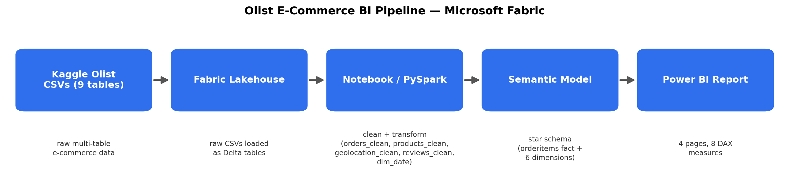

# Olist E-Commerce BI Project — Microsoft Fabric

An end-to-end BI project built on Microsoft Fabric, analyzing 100k+ Brazilian e-commerce orders (the [Olist dataset](https://www.kaggle.com/datasets/olistbr/brazilian-ecommerce)) to surface delivery performance and customer satisfaction drivers. Built to go beyond a single-file Power BI exercise — it covers the full pipeline: Lakehouse ingestion, PySpark transformation, a star-schema semantic model, DAX time-intelligence measures, and a 4-page report.

## Architecture



Raw CSVs → Fabric Lakehouse (Delta tables) → Notebook/PySpark cleaning & transformation → star-schema semantic model → Power BI report.

## Key findings

- On-time delivery rate: **81.46%**
- Average customer review score: **4.09 / 5**
- Average delivery time: **19.69 days** — varies notably by customer state, with PB, AL and SE seeing the longest average delivery times (see the Delivery Performance page)

## Tools used

- **Microsoft Fabric Lakehouse** — raw data storage as Delta tables
- **Fabric Notebook (PySpark)** — data cleaning and transformation
- **Power BI / DAX** — star-schema semantic model and time-intelligence measures
- **Power BI Desktop** — 4-page interactive report

## Report pages

1. **Sales Overview** — Total Sales, YoY %, MoM % cards; sales trend line; sales by category; Year slicer
2. **Delivery Performance** — Avg Delivery Days, On-Time Delivery % cards; delivery time by category and by state
3. **Customer Insights** — Avg Review Score card; delivery time vs. review score scatter by category
4. **Geography** — sales by customer state (map)

DAX measures are documented in [`dax/measures.md`](dax/measures.md).

## What I learned

- A null-check on a string column doesn't catch empty strings — `review_score` had 2,555 blank values (~2.5% of the reviews table) that only surfaced after casting the column to numeric and re-filtering.
- `overwriteSchema` vs. `mergeSchema` in Delta Lake: `overwriteSchema` is correct for a full overwrite with an intentional schema change; `mergeSchema` is meant for appends.
- A Direct Lake semantic model doesn't automatically pick up schema changes made in the Lakehouse — refreshing sometimes requires removing and re-adding the affected table to the model.
- Power BI conditional formatting rules compare against a measure's underlying decimal value, not its displayed percentage text (e.g. `0.15`, not `15`) — an easy way for a rule to silently never fire.
- Fabric trial capacity admin rights and full Power BI tenant admin rights are separate things — this is why "Publish to Web" wasn't available on this workspace (see Sharing note below).

## Sharing note

The report is hosted on a Fabric trial workspace; org-level tenant settings restrict public web publishing on this account. To explore it:

- Watch the walkthrough video: [`docs/screenshots/report-walkthrough.mp4`](docs/screenshots/report-walkthrough.mp4) for a full interactive demo of all 4 pages.
- Open [`pbix/Ecommerce BI Report.pbix`](pbix/Ecommerce%20BI%20Report.pbix) in Power BI Desktop. *(Note: if the underlying semantic model is Direct Lake, this file may require a live connection back to the Fabric workspace to render data rather than working fully offline.)*

## Data source

Dataset: [Brazilian E-Commerce Public Dataset by Olist](https://www.kaggle.com/datasets/olistbr/brazilian-ecommerce), used under its Kaggle license. All credit to Olist for the original data.

## Repo structure

```
/pbix/                   → exported Power BI report (.pbix)
/dax/measures.md          → all DAX measures with explanations
/etl/                     → Fabric notebook used for cleaning/transformation
/docs/architecture.png    → pipeline diagram
/docs/screenshots/        → report screenshots / walkthrough GIF
README.md
```
